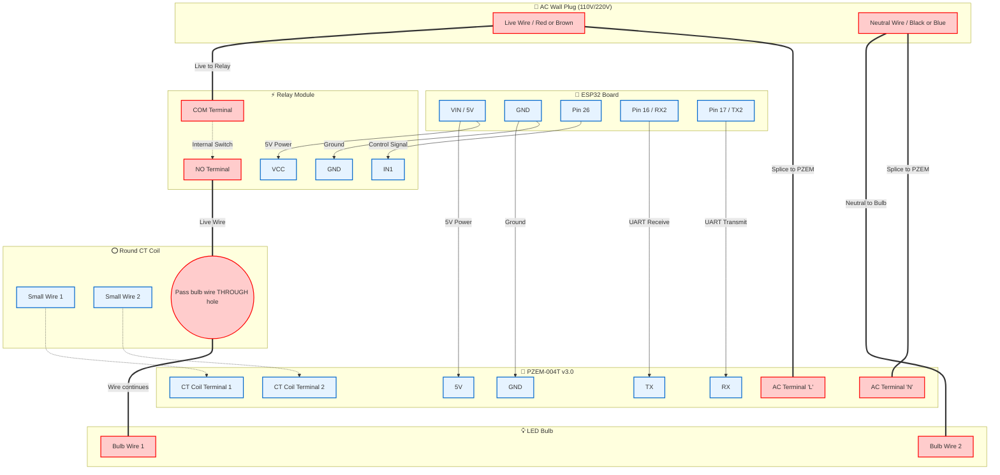

# EnerSense Hardware Wiring Guide

This document details the complete wiring diagram and pinouts for the EnerSense IoT node, consisting of an ESP32, a 2-Channel Relay Module, and a PZEM-004T v3.0 Energy Sensor.

## ⚠️ Safety Warning
**This project involves working with live AC mains voltage (110V/220V).**
- Always completely unplug the AC power cord from the wall before touching any wires, the relay board, or the PZEM module.
- Never touch the bottom of the relay module or PZEM board when AC power is connected.

---

## 1. Low-Voltage DC Wiring (ESP32)

### Power (5V & GND)
The ESP32 is powered via USB from your computer or a 5V USB adapter. The ESP32's `VIN` (or `5V`) pin is used to supply power to both the Relay and the PZEM logic side.
* **ESP32 5V/VIN** ➡️ Connects to **Relay VCC** *AND* **PZEM 5V** (splice wires together)
* **ESP32 GND** ➡️ Connects to **Relay GND** *AND* **PZEM GND** (splice wires together)

### Relay Control (GPIO)
* **ESP32 Pin D26** ➡️ Connects to **Relay IN1**

### PZEM Modbus (UART2)
* **ESP32 Pin D16 (RX2)** ➡️ Connects to **PZEM TX**
* **ESP32 Pin D17 (TX2)** ➡️ Connects to **PZEM RX**

---

## 2. High-Voltage AC Wiring (Load & Sensors)

### AC Mains Input
* **AC Live Wire (Wall)** ➡️ Splits to **PZEM 'L' Terminal** *AND* **Relay 'COM' Terminal**
* **AC Neutral (Wall)** ➡️ Splits to **PZEM 'N' Terminal** *AND* **Appliance/Bulb Neutral Wire**

### Switching & Current Sensing
* **Relay 'NO' Terminal** ➡️ Passes **THROUGH** the center hole of the round PZEM CT Coil ➡️ Connects to **Appliance/Bulb Live Wire**.
* **CT Coil small wires** ➡️ Connect to the two small screw terminals on the PZEM-004T.

---

## 3. Circuit Diagram

